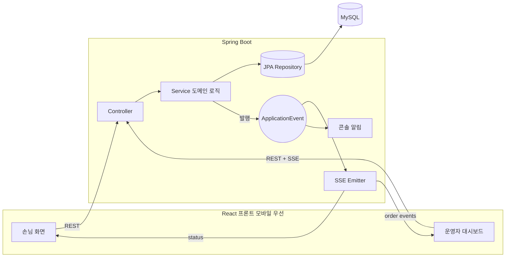

# brewtiful-sip ☕

홈카페 손님을 위한 **QR 기반 주문 웹서비스**. 손님은 QR로 접속해 원두를 보고 메뉴를 주문하며,
운영자는 실시간으로 주문을 받아 준비완료 처리하고, 손님은 준비완료된 메뉴에 리뷰를 남긴다.

> 트래픽 규모와 무관하게, IT 대기업 수준의 기술 스펙(SOLID·디자인 패턴·MSA 지향 아키텍처·이벤트
> 기반·CI)을 **처음부터 의식적으로 적용**한 이력서/포트폴리오용 프로젝트. 기능의 화려함보다
> "왜 이렇게 설계했는가"를 설명할 수 있는 코드를 우선한다.


## 주요 기능 (Phase 1 — 완료)

- 원두/메뉴 조회 (`GET /beans`, `GET /menus`)
- 장바구니 주문 생성 및 주문 토큰 발급 (`POST /orders`)
- 손님 주문 상태 조회 — 공유 가능한 토큰 링크 (`GET /orders/{id}?token=`)
- 운영자 준비완료 처리 — 마스터 코드 인증 (`PATCH /orders/{id}/status`)
- **실시간 SSE**: 운영자 대시보드 신규 주문 push, 손님 상태 변경 push
- 메뉴(주문 항목) 단위 리뷰 — 준비완료 후 3일 이내·1항목 1리뷰 제약
- 모바일 우선 React 프론트엔드 (손님 화면 + 운영자 실시간 대시보드)

## 기술 스택

| 영역 | 스택 |
|---|---|
| Backend | Java 21, Spring Boot 3.3, Spring Data JPA, Spring Security |
| DB / Migration | MySQL 8 (운영/개발), H2 (테스트), Flyway |
| Realtime | Spring `ApplicationEvent` → SSE(Server-Sent Events) |
| Frontend | React 18, Vite, `@microsoft/fetch-event-source` |
| Build / CI | Gradle (Kotlin DSL), GitHub Actions |
| Infra | Docker Compose (로컬 MySQL) |
| Test | JUnit5, Mockito, Spring MockMvc |

## 아키텍처 개요

계층형(Controller–Service–Repository)이되 **패키지는 도메인 단위**로 분리해 이후 MSA 분리를
대비한다. 알림/실시간은 도메인 이벤트로 결합도를 낮췄다.



- **Controller는 얇게**, 도메인 로직은 Service에, 트랜잭션 경계는 Service에서 명시.
- **Entity ↔ DTO 분리** (Entity 직접 노출 금지), 예외는 전역 `@RestControllerAdvice`로 통일.
- **이벤트 기반 알림**: 주문 생성/상태 변경을 `ApplicationEvent`로 발행 → 콘솔 알림·SSE가
  각자 구독(옵저버 패턴). Phase 3의 Kafka 전환을 위한 사전 포석.

자세한 설계 근거는 [`docs/architecture.md`](docs/architecture.md)와
[`docs/decisions.md`](docs/decisions.md)(ADR) 참고.

## 실행 방법

### 1) 로컬 MySQL (Docker)

```bash
docker compose -f infra/docker-compose.yml up -d   # 호스트 3307 → 컨테이너 3306
```

### 2) 백엔드

```bash
cd backend
gradle wrapper --gradle-version 8.10.2   # 최초 1회 (wrapper 미포함 시)
export BREWTIFUL_MASTER_CODE=local-master-1234
./gradlew bootRun                        # Flyway가 스키마 생성
# 초기 원두/메뉴 시드
docker exec -i brewtiful-mysql mysql --default-character-set=utf8mb4 \
  -ubrewtiful -pbrewtiful brewtiful < docs/sql/seed.sql
```

### 3) 프론트엔드

```bash
cd frontend
npm install
npm run dev     # http://localhost:5173  (운영자: http://localhost:5173/#owner)
```

## API 요약

| Method | Path | 설명 | 인증 |
|---|---|---|---|
| GET | `/beans` | 원두 목록 | - |
| GET | `/menus` | 메뉴 목록 | - |
| POST | `/orders` | 주문 생성 | - |
| GET | `/orders/{id}?token=` | 주문 상태 조회 | 주문 토큰(쿼리) |
| PATCH | `/orders/{id}/status` | 상태 변경(준비완료) | `X-Master-Code` |
| GET | `/orders/pending` | 미완료 주문 목록 | `X-Master-Code` |
| GET | `/orders/stream` | 운영자 실시간 스트림(SSE) | `X-Master-Code` |
| GET | `/orders/{id}/stream?token=` | 손님 상태 스트림(SSE) | 주문 토큰(쿼리) |
| POST | `/order-items/{id}/reviews` | 리뷰 작성 | `X-Order-Token` |
| GET | `/reviews?menuId=` | 리뷰 목록 | - |

전체 스펙: [`docs/api-docs/openapi.yaml`](docs/api-docs/openapi.yaml)

## 프로젝트 구조

```
brewtiful-sip/
├── backend/           # Spring Boot (도메인 단위 패키지: bean, menu, order, review, notification, common)
├── frontend/          # React + Vite (손님/운영자, 모바일 우선)
├── infra/             # docker-compose (MySQL)
├── docs/              # 기능명세서, ERD, api-docs(OpenAPI), decisions(ADR), sql(seed)
└── .github/workflows/ # CI
```

## 로드맵

- **Phase 1 — MVP (완료)**: 모놀리식, 도메인 단위 패키지, 주문/리뷰/실시간 SSE, 모바일 프론트.
- **Phase 2 — 확장 1 (진행)**: CI(GitHub Actions) ✅ → 카카오톡/슬랙 알림, Redis 캐싱.
- **Phase 3 — 확장 2**: 도메인별 서비스 분리(MSA), Kafka 이벤트, K8s, 관측성.

## 문서

- [기능명세서](docs/기능명세서.md) · [ERD](docs/ERD.md) · [OpenAPI](docs/api-docs/openapi.yaml)
- [아키텍처](docs/architecture.md) · [아키텍처 결정 기록(ADR)](docs/decisions.md)
