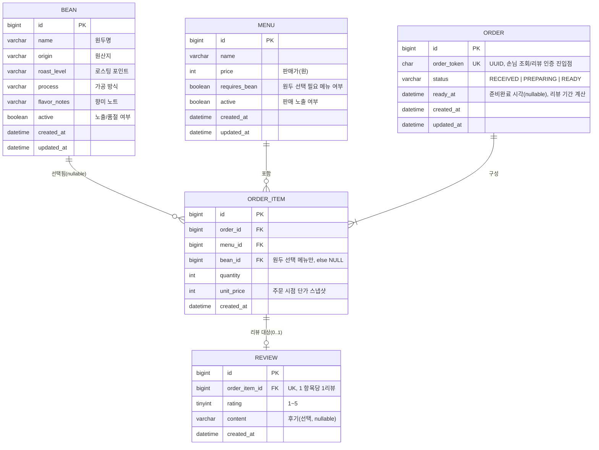

# brewtiful-sip ERD (Phase 1 — MVP)

버전: v0.2 (원두 동적 API화 반영 — ADR-0002)
관련 문서: `CLAUDE.md`, `docs/기능명세서.md`, `docs/decisions.md`, `docs/api-docs/`(예정)

---

## 1. 설계 원칙

- Phase 1 MVP 범위. Redis/Kafka 등 확장 단계 산출물은 스키마에 반영하지 않는다.
- 패키지는 도메인 단위(`bean`, `menu`, `order`, `review`)로 분리하되, 물리 스키마는 단일 MySQL
  인스턴스를 공유한다 (Phase 3 MSA 분리 시 경계를 넘는 FK는 논리 참조로 완화 — 6장 참고).
- Entity는 API에 직접 노출하지 않는다. 응답은 별도 DTO로 매핑한다.
- Enum(주문 상태)은 `ORDINAL`이 아니라 `STRING`으로 저장한다 (값 추가/순서 변경 내성).
- 금액처럼 시점 의존 값은 **주문 시점 스냅샷**으로 저장한다 (`order_item.unit_price`).

## 2. 엔티티 개요

| 엔티티 | 역할 | 비고 |
|---|---|---|
| `Bean` | 원두 마스터(단일 출처) | 원두 상세를 DB에서 관리하고 `GET /beans`로 조회. 프론트는 API로 동적 로딩 (ADR-0002). FK 무결성도 확보 (ADR-0001) |
| `Menu` | 판매 메뉴 | 원두 선택 필요 여부(`requires_bean`) 보유 |
| `Order` | 주문(장바구니 단위) | `order_token`(UUID)로 손님 조회, 상태/준비완료 시각 관리 |
| `OrderItem` | 주문 내 개별 메뉴 항목 | 리뷰 단위. 원두 선택 메뉴는 `bean_id` 참조 |
| `Review` | 메뉴(주문 항목)별 리뷰 | `order_item`당 1건 (DB unique 제약) |

## 3. ER 다이어그램

## 4. 관계 정의

- `Order` 1 — N `OrderItem`: 한 주문에 여러 메뉴 항목(장바구니). `OrderItem.order_id`는 필수.
  주문 삭제 시 항목도 함께 정리(애플리케이션 레벨 cascade; 물리 삭제보다 상태 관리 우선).
- `Menu` 1 — N `OrderItem`: 항목은 반드시 하나의 메뉴를 가리킨다(`menu_id` 필수).
- `Bean` 1 — N `OrderItem`: 원두 선택이 필요한 메뉴 항목만 `bean_id` 참조. 그 외에는 `NULL`.
  `Menu.requires_bean == true` ↔ `bean_id != null` 정합성은 Service 계층에서 검증(도메인 규칙).
- `OrderItem` 1 — 0..1 `Review`: 항목당 리뷰 최대 1건. `Review.order_item_id`에 **UNIQUE**를
  걸어 "1 주문항목 1리뷰" 제약을 DB 레벨로 강제한다 (Service 검증 + DB 제약 이중 방어).

## 5. 인덱스 후보

| 테이블 | 컬럼 | 종류 | 목적 |
|---|---|---|---|
| `order` | `order_token` | UNIQUE | 손님 주문 조회/리뷰 인증의 단일 진입점 |
| `order` | `status` | INDEX | 운영자 대시보드 미완료 주문 조회(`RECEIVED`/`PREPARING`) |
| `order_item` | `order_id` | INDEX | 주문 상세 조회(항목 로딩) |
| `order_item` | `menu_id` | INDEX | 메뉴별 리뷰 모아보기 조인 경로 |
| `order_item` | `bean_id` | INDEX | (선택) 원두별 소비 통계 여지 |
| `review` | `order_item_id` | UNIQUE | 1리뷰 제약 + 존재 여부 조회 |
| `bean` | `active` | INDEX | `GET /beans` 노출(품절 제외) 필터 |

> 리뷰 "메뉴별 모아보기"는 `review → order_item(menu_id) → menu` 경로로 조회한다.
> 조회 빈도가 높아지면 Phase 2에서 `Review`에 `menu_id` 비정규화 컬럼 추가를 재검토한다.

## 6. 주요 설계 결정과 트레이드오프 (면접 설명용)

- **원두 = DB 단일 출처 + 조회 API** (ADR-0002): 원두 상세를 `bean` 테이블에서 관리하고
  `GET /beans`로 노출한다. 프론트는 API로 동적 로딩하므로 초기 하드코딩 방식의 "프론트 목록 ↔
  DB" 이중 관리가 사라졌다. 품절은 `active` 플래그로 제어하고, 원두 등록/수정은 Phase 1에서
  시드 SQL(`docs/sql/`)로 관리(관리자 쓰기 API는 미도입).
- **원두 참조 = Bean FK** (ADR-0001): 주문 항목이 문자열이 아닌 `bean_id` FK로 원두를 가리켜
  참조 무결성을 확보한다. 원두가 DB 단일 출처가 되면서 이 FK의 이중 관리 단점도 해소됐다.
- **`unit_price` 스냅샷**: 주문 이후 메뉴 가격이 바뀌어도 과거 주문 금액이 흔들리지 않도록
  주문 시점 단가를 항목에 복제 저장한다 (회계·조회 정합성).
- **`ready_at` 분리 저장**: 리뷰 작성 가능 기간(준비완료 후 3일)을 `updated_at`이 아닌 전용
  컬럼으로 계산해, 이후 다른 상태 변경이 기준 시점을 오염시키지 않게 한다.
- **리뷰 단위 = OrderItem**: 리뷰를 주문 전체가 아닌 항목에 매달아 "메뉴별 리뷰"를 자연스럽게
  표현한다. `order_item_id` UNIQUE로 재작성 방지를 스키마에 못 박았다.
- **MSA 대비**: Phase 3에서 도메인 분리 시 `order_item.menu_id`, `order_item.bean_id`처럼
  경계를 넘는 FK는 물리 제약을 풀고 논리적 ID 참조 + 애플리케이션 정합성으로 전환하는 것을
  기본 방향으로 둔다 (지금은 단일 스키마이므로 물리 FK 유지).

## 7. 미결/후속

- 초기 시드 데이터(메뉴, 원두) 및 자주 쓰는 쿼리는 `docs/sql/`에 정리(명세 3.7).
- 상태 이력(감사 로그)이 필요해지면 `order_status_history` 테이블 도입은 Phase 2 이후 검토.
- ERD 확정 → `docs/api-docs/`(OpenAPI) 초안 작성.
