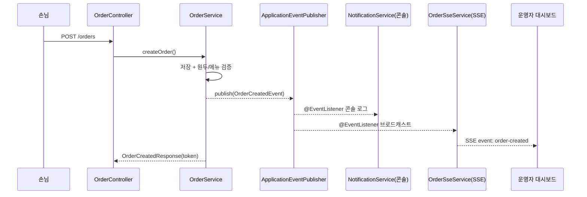

# 아키텍처 문서

이 문서는 brewtiful-sip의 구조와 **설계 근거(면접에서 설명 가능한 수준)**를 정리한다.
결정의 트레이드오프는 [`decisions.md`](decisions.md)(ADR)와 상호 참조한다.

## 1. 계층 구조와 패키지 전략

계층형(Controller–Service–Repository)을 따르되, 물리 패키지는 **도메인 단위**로 나눈다.

```
com.brewtifulsip
├── bean/          (domain, repository, service, dto, api)
├── menu/
├── order/         (+ event: OrderCreatedEvent, OrderStatusChangedEvent)
├── review/
├── notification/  (service: 콘솔 알림 리스너, sse: SSE 브로드캐스터, api: 스트림 컨트롤러)
└── common/        (config, exception, dto, entity, security)
```

- **왜 도메인 패키지인가**: 계층(controller/service/...)으로 먼저 나누면 하나의 기능 변경이 여러
  패키지에 흩어진다. 도메인으로 나누면 응집도가 높아지고, Phase 3에서 서비스(order-service,
  review-service...)로 분리할 때 패키지를 그대로 모듈로 승격하기 쉽다.
- **common**은 도메인 간 공유 관심사(전역 예외, 보안, 시간 감사 엔티티)만 둔다.

## 2. SOLID / 설계 원칙 적용

- **SRP**: Controller는 요청 바인딩·위임만(얇게), 도메인 규칙은 Service, 상태 전이 규칙은 엔티티
  (`Order.changeStatus`, `OrderStatus.canTransitionTo`)에 캡슐화.
- **OCP/DIP**: 알림 확장을 상속이 아니라 **이벤트 구독**으로 연다. 새 알림 수단(카카오/슬랙)은
  기존 코드를 고치지 않고 리스너를 추가하면 된다.
- **과한 추상화 지양**: 유저스토리 없이 인터페이스를 남발하지 않는다(예: `BeanService`는 구현
  하나뿐이라 인터페이스를 만들지 않음). 필요해질 때 도입.
- **트랜잭션 경계**: Service에서 `@Transactional` 명시, 조회는 `readOnly`.
- **Entity ↔ DTO 분리**: 응답은 record DTO로 매핑해 Entity 직접 노출을 금지(`from()` 정적 팩토리).

## 3. 이벤트 기반 알림 / 실시간(SSE)

주문 도메인은 알림·실시간 전송을 **직접 호출하지 않고** 도메인 이벤트를 발행한다.



- **결합도**: `OrderService`는 `NotificationService`/`OrderSseService`를 몰라도 된다. 발행만 한다.
- **확장성**: Phase 3에서 `ApplicationEvent` 발행 지점을 Kafka 프로듀서로 바꾸고, 리스너를 컨슈머로
  옮기면 이벤트 기반 아키텍처가 자연스럽게 분산 시스템으로 확장된다.
- **SSE 선택**: 서버→클라이언트 단방향 push라 WebSocket보다 단순하고 HTTP 인프라와 잘 맞는다.
  운영자 스트림은 `X-Master-Code` 헤더 인증이 필요해 프론트는 헤더를 실을 수 있는
  `@microsoft/fetch-event-source`를 사용(브라우저 기본 `EventSource`는 커스텀 헤더 불가).

## 4. 인증 전략 (Phase 1)

- **손님**: 회원 없음. 주문 시 발급한 `orderToken`(UUID)으로 조회/리뷰를 인가. 상태 조회 GET은
  공유 가능한 딥링크라 쿼리 파라미터, 리뷰 작성 등 액션은 `X-Order-Token` 헤더.
- **운영자**: 계정 대신 고정 마스터 코드(`X-Master-Code`)를 인터셉터에서 상수시간 비교(ADR-0003).
  값은 환경변수로 외부화. MVP 스코프에 맞춘 선택이며 Phase 2에서 정식 인증으로 승격 예정.

## 5. 데이터 정합성

- **가격 스냅샷**: `order_item.unit_price`에 주문 시점 단가를 복제 저장 → 이후 메뉴 가격이 바뀌어도
  과거 주문 금액이 흔들리지 않는다.
- **`ready_at` 전용 컬럼**: 리뷰 작성 기간(준비완료 후 3일)의 기준 시점을 다른 상태 변경이
  오염시키지 않도록 분리.
- **1항목 1리뷰**: `review.order_item_id` UNIQUE로 DB 레벨에서 강제 + Service 검증(이중 방어).
- **스키마 소유권**: 운영 스키마는 Flyway(`V1__init.sql`)가 소유하고 JPA는 `ddl-auto=validate`로
  검증만 한다. 테스트는 H2에 엔티티 기반(`create-drop`).

## 6. 테스트 전략

- **단위 테스트**: Service 로직은 Mockito로 협력자를 대체(빠르고 결정적).
- **슬라이스 테스트**: Repository는 `@DataJpaTest`(H2)로 쿼리 메서드 검증.
- **통합 테스트**: `@SpringBootTest` + MockMvc로 컨트롤러·전역 예외·운영자 인증 인터셉터를
  실제 요청 흐름으로 검증.
- **CI**: 푸시/PR마다 GitHub Actions가 백엔드 테스트와 프론트 빌드를 자동 실행.

## 7. MSA 전환 대비 (Phase 3)

- 도메인 패키지를 서비스 경계로 승격. 현재 monolith에서 물리 FK로 잡은 교차 도메인 참조
  (`order_item.menu_id`, `review.order_item_id` 등)는 서비스 분리 시 논리 참조 + 애플리케이션
  정합성으로 완화하는 것을 기본 방향으로 둔다([`ERD.md`](ERD.md) 6장).
- 이벤트 발행/구독 지점을 메시지 브로커(Kafka)로 교체.
